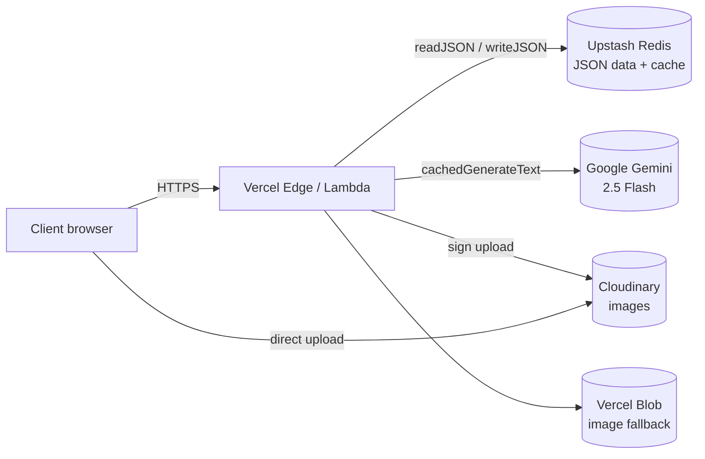
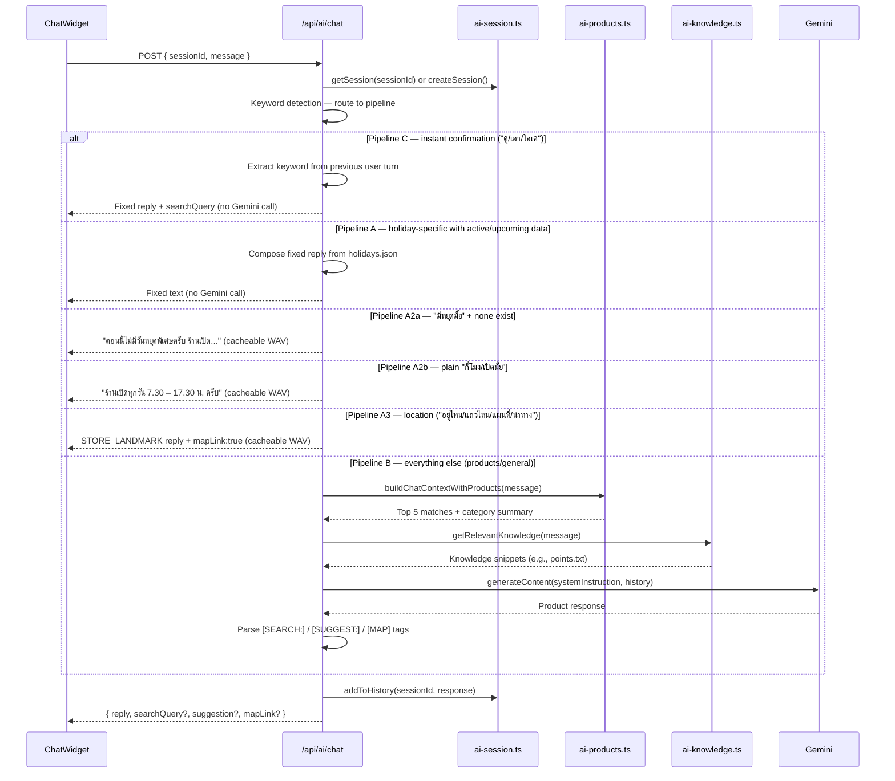
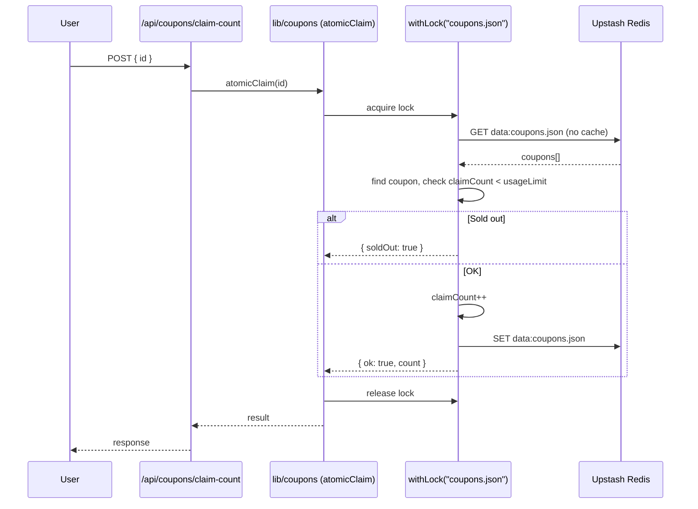
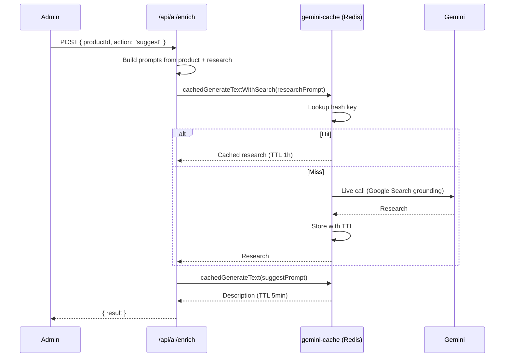

# Architecture

31panich is a thin Next.js app over a JSON+Redis data store, with Gemini for AI features and Cloudinary for images. There is no SQL database. All "tables" are JSON files cached in Upstash Redis with in-process caching on top.

## High-level component map

## Storage layer (`lib/blob-store.ts`)

Three modes, picked at runtime from env vars:

| Mode | When | Where data lives |
|---|---|---|
| `redis` | `UPSTASH_REDIS_REST_*` env set (production) | Upstash Redis, key `data:<filename>` |
| `blob` (legacy) | `BLOB_READ_WRITE_TOKEN` set, no Redis | Vercel Blob storage |
| `local-fs` | neither set (dev) | `web/data/*.json` on disk |

On top of all three:

- **In-memory cache** (`Map`, 30s TTL) deduplicates reads inside a warm lambda
- **Per-file write lock** (`withLock`) queues concurrent writes so read-modify-write is safe
- **Seeding**: first read from Redis falls back to local file and writes through (one-time migration)

## Request flow: load homepage `/`

Most pages are **prerendered statically** via `generateStaticParams` (15 categories + every product), revalidated every hour. Only API routes and the admin panel are fully dynamic.

## Request flow: AI chat

**Multi-pipeline design**: AI chat uses keyword detection to route to separate pipelines. A/A2a/A2b/A3 return **deterministic** replies (no Gemini call) so they can be pre-rendered as static WAV audio. Only Pipeline B hits Gemini. This saves API cost on the most common questions (hours, location, confirmation) and avoids cross-contamination (e.g., product pipeline volunteering holiday info).

**TTS static cache** (v2.0.10): when a reply from a deterministic pipeline matches `CACHED_TTS_REPLIES` in `web/lib/tts-cache.ts`, the client plays the pre-generated WAV from `public/audio/tts/*.wav` (CDN-served) and skips `/api/ai/tts` entirely — zero Gemini TTS cost, instant playback. Regenerate cache with `node scripts/gen-tts-cache.mjs`.

**Tag rendering in ChatWidget**:
- `[SEARCH:keyword]` → auto-navigate to `/products?search=...` (panel stays open, user likely continues chat)
- `[SUGGEST:keyword]` → render purple "ดูสินค้า X" button; click closes panel + navigates
- `[MAP]` (or Pipeline A3 `mapLink:true`) → render cyan "นำทางไปร้าน" button; opens Google Maps in new tab

**Why chat is not cached** (at the Gemini-response layer): `gemini-cache.ts` exists but is opt-in. Pipeline B chat contents grow with every turn (history included), so cache hits would be near zero. Use it for `enrich` and other deterministic flows instead. TTS cache is different — it caches the *audio* for the deterministic pipeline outputs, where text is known to be byte-identical.

## Request flow: claim a coupon (atomic)

The lock is **per-instance** (in-process `Map`), so two concurrent lambdas could still race. For 31panich's traffic this has been acceptable; if it ever becomes a problem, swap to Redis SETNX-based distributed locks.

## Request flow: admin enrich product (with Gemini cache)

Same flow for `action: "check"`, with a different prompt template.

## Auth model

- Sessions are HMAC-SHA256-signed cookies (`admin_session`), 7-day expiry
- Users are stored in env var `ADMIN_USERS` as JSON: `[{id, password, role, name}]`
- Two roles: `admin` (full) and `manager` (everything except delete-coupon and ai-config)
- Enforcement: middleware blocks `/api/admin/ai-config` for managers; each destructive route also calls `canPerform(role, action)` defensively

See `web/lib/auth.ts` and `web/middleware.ts`.

## Image pipeline

1. Admin clicks upload in `/admin/products` or `/admin/coupons`
2. Frontend → POST `/api/upload/sign` → returns Cloudinary signature + params
3. Frontend → direct upload to `https://api.cloudinary.com/v1_1/<cloud>/image/upload`
4. Cloudinary returns final URL → saved into `products.json` / `coupons.json`

This bypasses our backend entirely for the actual file bytes — saving Vercel bandwidth + function time.

## Things that surprise people

- **No database**. JSON files in Redis.
- **No authentication on some POST routes** (`/api/products`, `/api/coupons` POST). This is a known smell — see [`debugging.md`](./debugging.md).
- **Chat sessions live in Lambda memory**, not Redis. They die on cold start. This is intentional (chat history is small + non-critical).
- **`web/data/*.json` is dev-only**. In production those files exist on disk too (for seeding) but the live data is in Redis.
- **The git repo is `web/`, not the project root**.
