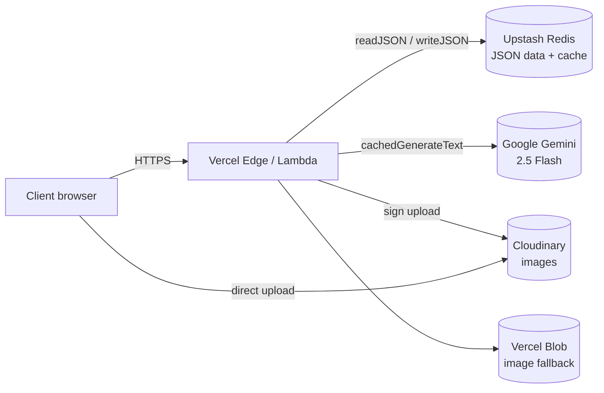
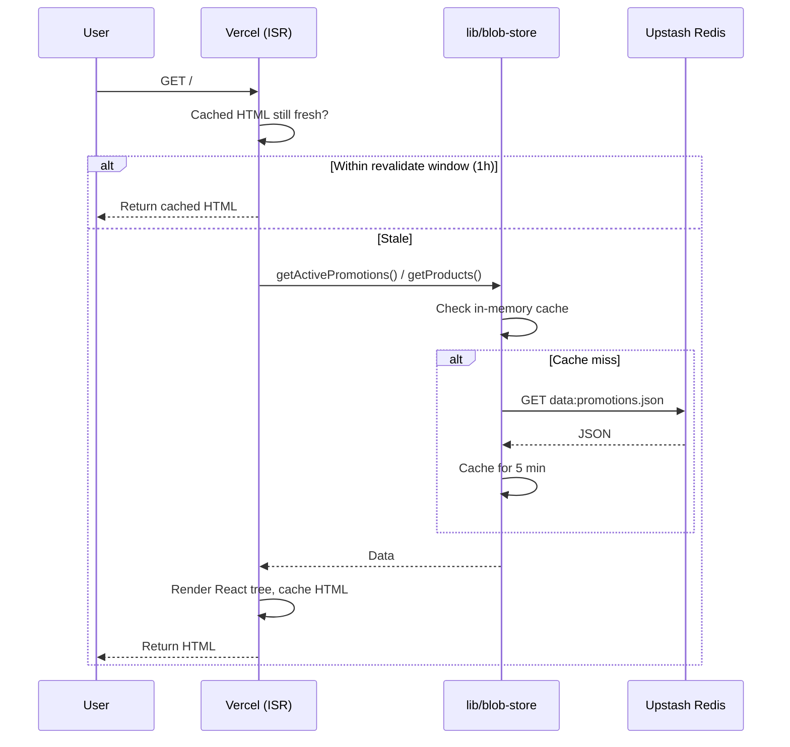
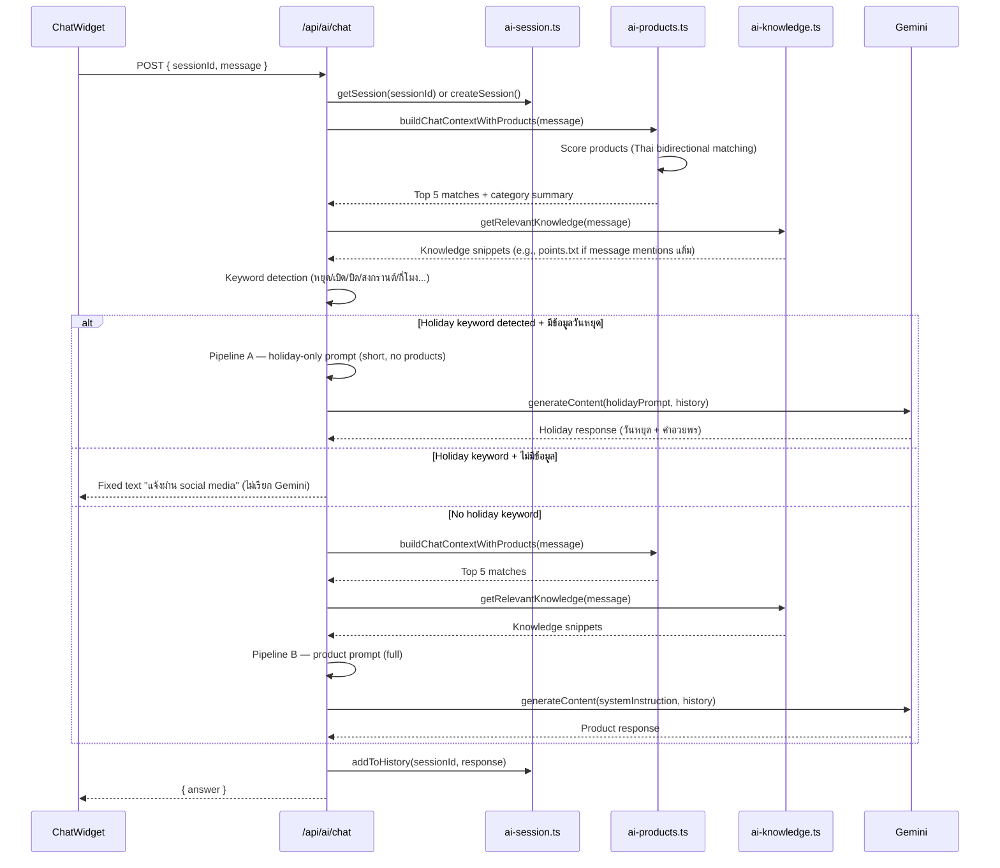
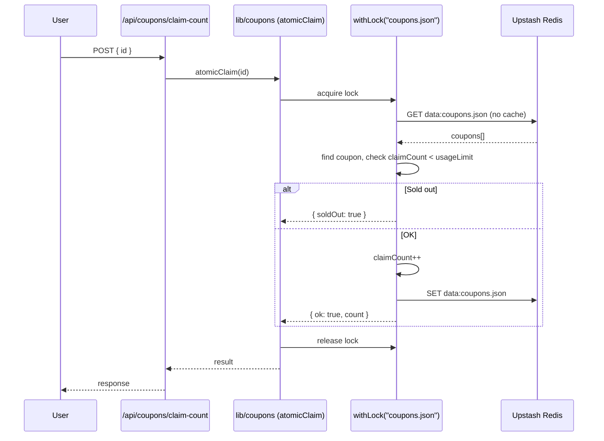
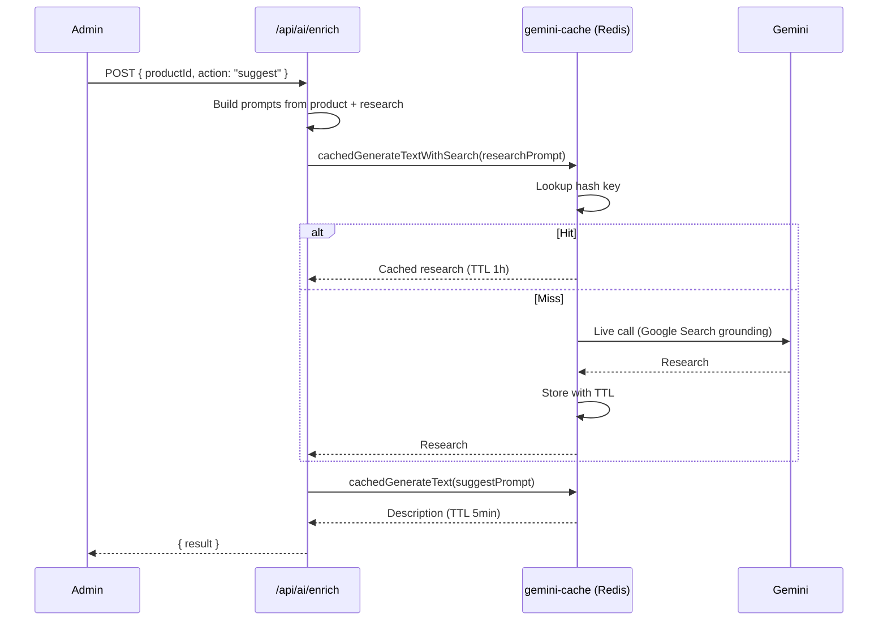

# Architecture

31panich is a thin Next.js app over a JSON+Redis data store, with Gemini for AI features and Cloudinary for images. There is no SQL database. All "tables" are JSON files cached in Upstash Redis with in-process caching on top.

## High-level component map

## Storage layer (`lib/blob-store.ts`)

Three modes, picked at runtime from env vars:

| Mode | When | Where data lives |
|---|---|---|
| `redis` | `UPSTASH_REDIS_REST_*` env set (production) | Upstash Redis, key `data:<filename>` |
| `blob` (legacy) | `BLOB_READ_WRITE_TOKEN` set, no Redis | Vercel Blob storage |
| `local-fs` | neither set (dev) | `web/data/*.json` on disk |

On top of all three:

- **In-memory cache** (`Map`, 5-min TTL) deduplicates reads inside a warm lambda
- **Per-file write lock** (`withLock`) queues concurrent writes so read-modify-write is safe
- **Seeding**: first read from Redis falls back to local file and writes through (one-time migration)

## Request flow: load homepage `/`

Most pages are **prerendered statically** via `generateStaticParams` (15 categories + every product), revalidated every hour. Only API routes and the admin panel are fully dynamic.

## Request flow: AI chat

**Dual pipeline design** (v1.5.18+): AI chat uses keyword detection to route questions to separate pipelines. Holiday questions get a short focused prompt with only holiday data (no products to confuse Gemini). Product questions get the full product prompt with no holiday info mixed in. This prevents cross-contamination where Gemini answers holiday questions with product info or vice versa.

**Why chat is not cached**: `gemini-cache.ts` exists but is opt-in. Chat contents grow with every turn (history is included), so cache hits would be near zero. Use it for `enrich` and other deterministic flows instead.

## Request flow: claim a coupon (atomic)

The lock is **per-instance** (in-process `Map`), so two concurrent lambdas could still race. For 31panich's traffic this has been acceptable; if it ever becomes a problem, swap to Redis SETNX-based distributed locks.

## Request flow: admin enrich product (with Gemini cache)

Same flow for `action: "check"`, with a different prompt template.

## Auth model

- Sessions are HMAC-SHA256-signed cookies (`admin_session`), 7-day expiry
- Users are stored in env var `ADMIN_USERS` as JSON: `[{id, password, role, name}]`
- Two roles: `admin` (full) and `manager` (everything except delete-coupon and ai-config)
- Enforcement: middleware blocks `/api/admin/ai-config` for managers; each destructive route also calls `canPerform(role, action)` defensively

See `web/lib/auth.ts` and `web/middleware.ts`.

## Image pipeline

1. Admin clicks upload in `/admin/products` or `/admin/coupons`
2. Frontend → POST `/api/upload/sign` → returns Cloudinary signature + params
3. Frontend → direct upload to `https://api.cloudinary.com/v1_1/<cloud>/image/upload`
4. Cloudinary returns final URL → saved into `products.json` / `coupons.json`

This bypasses our backend entirely for the actual file bytes — saving Vercel bandwidth + function time.

## Things that surprise people

- **No database**. JSON files in Redis.
- **No authentication on some POST routes** (`/api/products`, `/api/coupons` POST). This is a known smell — see [`debugging.md`](./debugging.md).
- **Chat sessions live in Lambda memory**, not Redis. They die on cold start. This is intentional (chat history is small + non-critical).
- **`web/data/*.json` is dev-only**. In production those files exist on disk too (for seeding) but the live data is in Redis.
- **The git repo is `web/`, not the project root**.
